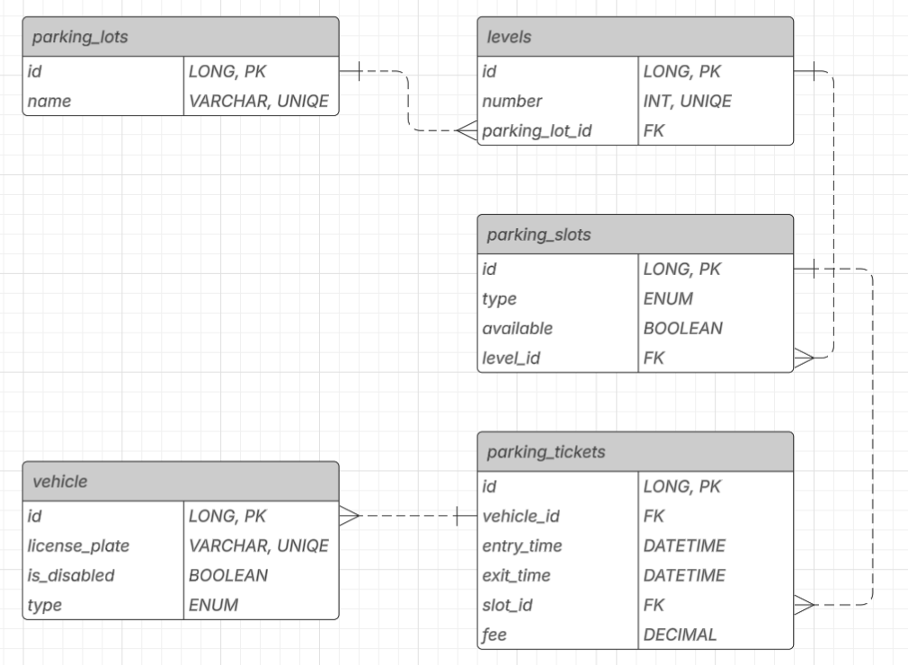

# Smart Parking System

A Spring Boot application that manages smart parking lots with multi-level structures, slot types, vehicle check-ins, and dynamic availability. Designed for admin operations and real-time vehicle management.

---

## Design Rationale

### Layered Architecture

- **Controller Layer**: REST API endpoints for admin and parking operations.
- **Service Layer**: Core business logic (transactional, consistent, testable).
- **Factory Layer**: Clean instantiation of domain objects (`Level`, `Slot`, `Vehicle`).
- **Repository Layer**: JPA-based data access.
- **DTOs**: Used for request and response abstraction.

### Key Entities

- `ParkingLot`: Contains multiple `Level`s.
- `Level`: Identified by `number`, holds a list of `ParkingSlot`s.
- `ParkingSlot`: Has `type` (COMPACT, LARGE, MOTORCYCLE) and availability.
- `Vehicle`: Has `licensePlate` and `type` (CAR, TRUCK, MOTORCYCLE).
- `ParkingTicket`: Tracks `Vehicle` check-in/out, duration, and fee.

---

## Domain Rules

- A level’s `number` must be unique within a `ParkingLot`.

- A slot’s availability can be toggled manually or by check-in/out logic.

- A vehicle cannot check in if already inside.

- Slot type must match vehicle type.

## Getting Started

### Requirements
- Java 17+

- Gradle

- Spring Boot 3.x


### Run Application
```bash
./gradlew bootRun
```
#### The server will start on http://localhost:8080.

Access H2 Console: http://localhost:8080/h2-console  
JDBC URL: `jdbc:h2:mem:store`  
Username: `sa`  
Password: `password`

---

## API Endpoints

### Admin Operations

| Method | Endpoint                                                                          | Description |
|--------|-----------------------------------------------------------------------------------|-------------|
| `POST`   | `/api/admin/lots?name=X`                                                          | Create parking lot |
| `DELETE` | `/api/admin/lots/{id}`                                                            | Delete parking lot |
| `POST`   | `/api/admin/lots/{id}/levels?number=N`                                            | Add level |
| `DELETE` | `/api/admin/lots/{id}/levels/{number}`                                            | Remove level |
| `POST`   | `/api/admin/lots/{id}/levels/{number}/slots`                                      | Add slot |
| `DELETE` | `/api/admin/lots/{id}/levels/{number}/slots/{slotId}`                             | Remove slot |
| `PUT`    | `/api/admin/lots/{id}/levels/{number}/slots/{slotId}/availability?available=true` | Set availability |
| `GET`    | `/api/admin/lots`                                                                 | Get all lots |

### Vehicle Operations

| Method | Endpoint | Description |
|--------|----------|-------------|
| `POST`   | `/api/parking/check-in` | Check in vehicle |
| `PUT`    | `/api/parking/check-out?licensePlate=X` | Check out vehicle |
| `GET`    | `/api/parking/tickets` | Get all active tickets |

---

## Deployment

- Currently supports single-instance deployment. Designed for potential scale-out with minor refactoring.

---

## Running Tests

```bash
./gradlew bootTestRun
```

#### Tests include:
- ParkingServiceTest
- VehicleServiceTest
- ParkingLotServiceTest
- AdminControllerTest

---

## Example Flow
1. Create lot: POST `/api/admin/lot?name=Main Lot`
2. Add level: POST `/api/admin/lot/1/level?number=0`
3. Add slot: POST `/api/admin/lot/1/level/0/slot`

```json
{
"type": "COMPACT",
"available": true
}
```
4. Check-in vehicle: POST `/api/parking/check-in`
```json
{
"licensePlate": "ABC123",
"type": "CAR"
}
```
5. Check-out vehicle: PUT `/api/parking/check-out?licensePlate=ABC123`

--- 

## Data structure



## Test Data (optional)
Use the following to auto-seed data:

```sql
INSERT INTO PARKING_LOTS (id, name) VALUES (1, 'Lot A');
INSERT INTO LEVELS (id, number, parking_lot_id) VALUES (1, 0, 1);
INSERT INTO PARKING_SLOTS (id, type, available, level_id) VALUES (1, 'COMPACT', true, 1);
```

---

## Tech Stack

- Spring Boot 3.x
- H2 in-memory DB
- Spring Data JPA
- JUnit 5 + Mockito
- Lombok

---

## Known Limitations,

- No persistence after restart (H2 in-memory).,
- No UI – interactions are via raw HTTP.,

## Future Improvements

- **Assign preferred slot types per vehicle class**
- **Add validation for vehicle plate**
- **Add AOP layer for logging**
- **Enable real-time availability tracking with WebSockets.**
- **Admin/user authentication** 

: (Authentication is currently disabled for simplicity. Future iterations will use Spring Security with role-based access (ADMIN/USER).”)

- **Add PostgreSQL/MySQL support.**
- **Integrate payment processing for ticket fees**
- **Vehicle Entry Statistics & Compatibility Adjustment**
: (Based on the collected data, the system could dynamically recommend changes to the slot compatibility configuration — for example, increasing the number of compact or handicapped slots during peak times or reducing oversized vehicle spots if rarely used. This data-driven approach would allow for:

: 1. Better space utilization

: 2. Adaptive parking lot configuration

: 3. Improved user experience

: 4. Reduced congestion and waiting times

: This improvement lays the foundation for future integration with AI-based decision-making or real-time dashboards for facility managers.)